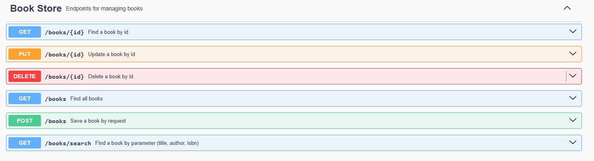
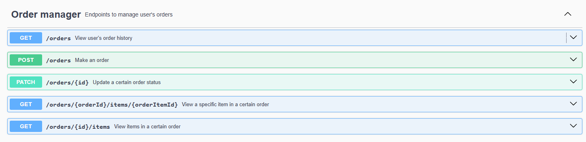
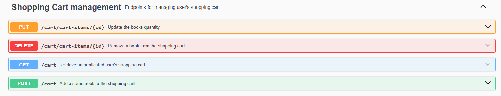

<h1 align="center"> BookStore Application </h1>

## Table of Contents

- [Introduction](#introduction)
- [Technology](#technology)
- [UML diagram](#uml-diagram)
- [Docker](#docker)
- [Endpoints](#endpoints)

## Introduction
This is a simple BookStore application built using Spring Boot, Spring Security, and MySQL. It provides basic functionalities to manage books, users, and authentication.
Project used as a reference for learning Spring Boot and Spring Security concepts.
Web infrastructure is built using Spring MVC, and the application is secured with Spring Security.
Objects are persisted in a MySQL database, and the application is packaged as a Docker image for easy deployment.
Database was based on Liquidbase, which is a database schema change management tool.

## Technology

- **Java**: Programming language used for the application.
- **Spring Boot**: Framework for building the application.
- **Spring Security**: Provides security features for the application.
- **MySQL**: Database used for storing application data.
- **Docker**: Containerization platform used to package the application.
- **Liquibase**: Database schema change management tool used for managing database changes.
- **Maven**: Build tool used for managing dependencies and building the application.
- **JUnit**: Testing framework used for writing unit tests.
- **Mockito**: Mocking framework used for writing unit tests.
- **GitHub Actions**: Used for continuous integration and deployment (CI/CD) of the application.
- **Swagger**: API documentation tool used for documenting the RESTful APIs of the application.
- **Postman**: Tool used for testing the RESTful APIs of the application.
- **MapStruct**: Object mapping framework used for mapping between different object models.
- **Lombok**: Library used to reduce boilerplate code in Java classes.
- **Spring Boot Test**: Provides testing support for Spring Boot applications.
- **Spring Data JPA**: Provides support for working with databases using JPA (Java Persistence API).

## UML diagram

## Docker

In order to run the application in a Docker container please execute the command "docker compose up" in the root directory of the project.

## Endpoints

### Book Endpoints

### Category Endpoints

### Order Endpoints

### ShoppingCart Endpoints

### User Endpoints (Authentication)

